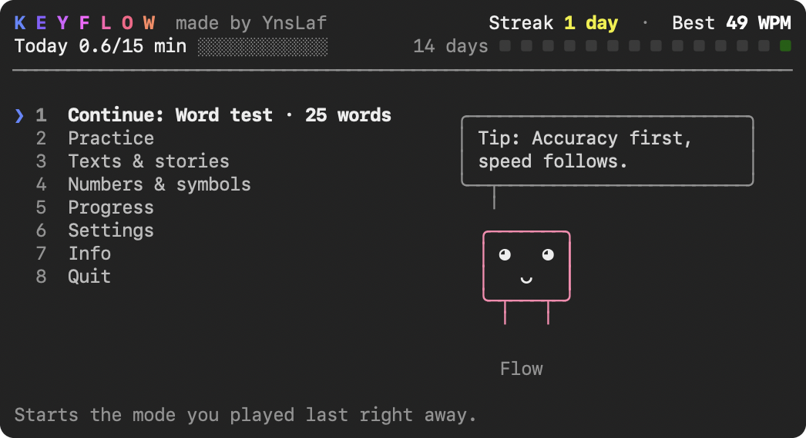
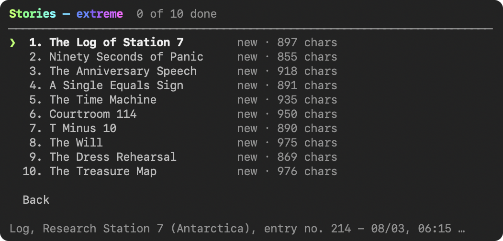
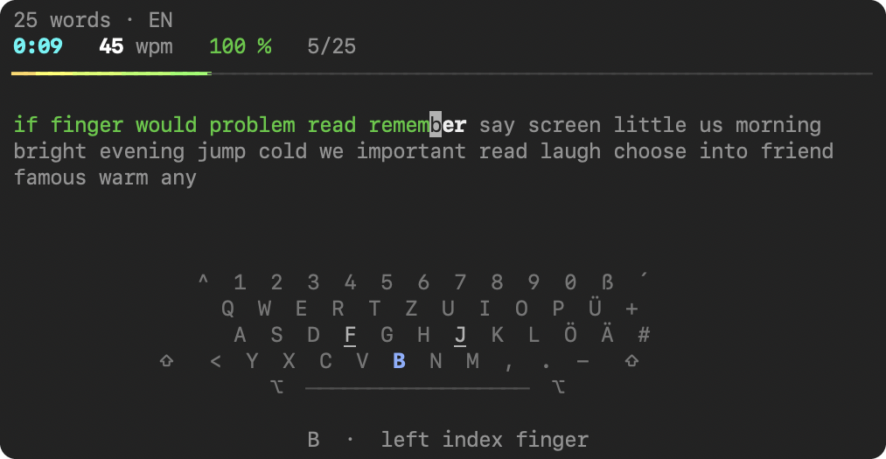
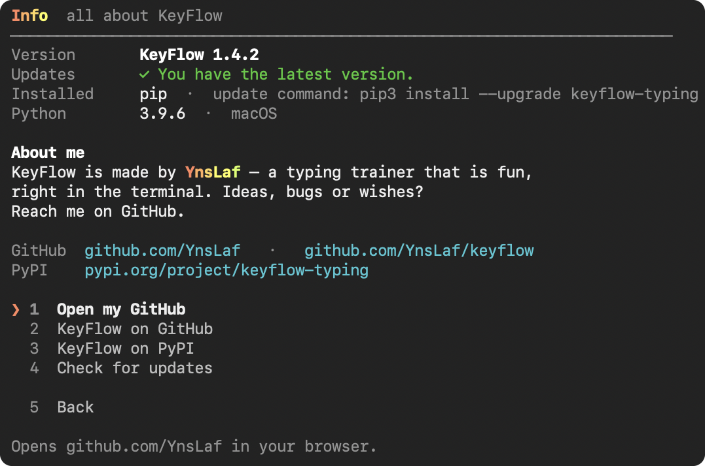

<p align="center">
  
</p>

<p align="center">
  <a href="https://pypi.org/project/keyflow-typing/"></a>
  
  
  
  <a href="https://github.com/YnsLaf"></a>
</p>

<p align="center">
  <b>KeyFlow</b> is a colorful typing trainer that lives in your terminal.<br>
  Time tests, an endless survival mode, 40 stories, a glowing on-screen keyboard,<br>
  records, an activity calendar – and <b>Flow</b>, a little mascot who cheers you on.
</p>

<p align="center">
  
</p>

## 🚀 Installation

> [!TIP]
> You only need **Python 3.8+**. Everything else is installed automatically.

### 🍏 macOS & 🐧 Linux – one command

```bash
curl -fsSL https://raw.githubusercontent.com/YnsLaf/keyflow/main/install.sh | sh
```

The installer checks Python, installs [pipx](https://pipx.pypa.io) if needed and
then installs KeyFlow. Afterwards just type:

```bash
keyflow
```

### 📦 With pip

```bash
pip install keyflow-typing
keyflow
```

On macOS the commands are called `pip3` and `python3`:

```bash
pip3 install --user keyflow-typing
python3 -m keyflow        # only once – afterwards just type: keyflow
```

> [!NOTE]
> pip often puts the `keyflow` command into a folder your terminal does not know.
> On its first start KeyFlow fixes that by itself – either right away (a link in a
> folder on your PATH) or from the next terminal window on (an entry in `~/.zshrc`).

<details>
<summary><b>🍺 macOS with pipx (cleanest way)</b></summary>

```bash
brew install pipx
pipx ensurepath
pipx install keyflow-typing
```
</details>

<details>
<summary><b>🪟 Windows</b></summary>

```bat
py -m pip install keyflow-typing
keyflow
```

Windows Terminal works best.
</details>

<details>
<summary><b>🔄 Updating</b></summary>

```bash
pipx upgrade keyflow-typing                    # installed with pipx
pip3 install --user --upgrade keyflow-typing   # installed with pip
```

Or simply open **Info → Update now** inside KeyFlow.
</details>

<details>
<summary><b>🧹 Uninstalling</b></summary>

The easiest way: open **Info → Delete KeyFlow** inside KeyFlow. It removes the
package, the `keyflow` command and the macOS Terminal profiles – and, if you want,
your statistics too.

By hand:

```bash
pip3 uninstall keyflow-typing      # or: pipx uninstall keyflow-typing
rm -f "$(command -v keyflow)"      # removes the keyflow link, if one is left
rm -rf ~/.keyflow                  # optional: your data
```

In the macOS Terminal you can also delete the "KeyFlow …" profiles under
*Terminal → Settings → Profiles*.
</details>

> [!IMPORTANT]
> The package on PyPI is called **`keyflow-typing`** (the name "keyflow" was already
> taken). The command is simply **`keyflow`**.

## 🌍 First start

Before KeyFlow starts for the first time, it asks:

```
Choose your language  ·  Wähle deine Sprache
❯ 1  English
  2  Deutsch
```

Menus, hints, statistics, achievements, Flow and the practice texts then use that
language. You can switch any time in the settings.

## 🎮 Modes

| | Mode | What happens |
|---|---|---|
| ⏱️ | **Time test** | As many words as possible in 15, 30, 60 or 120 seconds. |
| 🔤 | **Word test** | 10, 25, 50 or 100 words as fast as you can. |
| 🌊 | **Free mode** | No limit – the text never ends. Words, sentences, numbers, symbols or mixed. |
| ♾️ | **Endless mode** | Survival: start with 10 s, correct words add time, mistakes cost 1 s. Every 20 words the level rises. |
| 📚 | **Stories** | 40 stories in English and German – 10 easy, 10 medium, 10 hard, 10 extreme. |
| ✍️ | **Sentences** | Generated, grammatically correct sentences. |
| 🔢 | **Numbers** | Prices, times, dates, sums, units and phone numbers. |
| 🧩 | **Symbols** | Brackets, operators, paths, e-mails and code snippets. |
| 🌀 | **Mixed (pro)** | Words, capitals, punctuation, numbers and symbols all mixed up. |
| 💬 | **Quotes & proverbs** | Shakespeare, Austen, Dickens, Goethe, Kafka and many proverbs. |
| 🎯 | **Weak keys** | Text built from exactly the keys you get wrong the most. |
| 📝 | **Your own text** | Paste a text or load a `.txt` file – long texts are practiced in parts. |

<p align="center">
  
</p>

## ⌨️ While typing

<p align="center">
  
</p>

- 💡 The **next key lights up** on the keyboard under the text – with capitals and
  symbols also the right <kbd>⇧</kbd> / <kbd>⌥</kbd> / <kbd>AltGr</kbd>, plus a hint
  which finger to use.
- 🔴 Mistakes flash red, ✨ the current word glows and a 🌈 progress line flows above
  the text.

| Keys | Action |
|---|---|
| <kbd>⌫ Backspace</kbd> | delete the last character |
| <kbd>Ctrl</kbd> + <kbd>⌫</kbd> &nbsp;(macOS: <kbd>⌥</kbd> + <kbd>⌫</kbd>) | delete the whole word |
| <kbd>Tab</kbd> | restart with a new text |
| <kbd>Esc</kbd> | back to the menu (free & endless mode: finish and save) |
| <kbd>1</kbd> … <kbd>8</kbd> | jump straight to a menu entry |

## 📈 Progress

- 🏁 **Result after every test** – WPM and accuracy in big digits, raw WPM,
  consistency, a speed graph, the keys you missed and new records.
- 🏆 **Records** per mode, length and language.
- 📊 **History** of your recent tests with your trend.
- 🎹 **Keyboard view** – every key colored by your error rate.
- 🟩 **Activity calendar** like on GitHub, with current and longest streak.
- 🔥 **Daily goal & streak** always at the top of the menu.
- 🏅 **29 achievements** to unlock.

## 🎨 Look

- 🪟 **Glass background** – hue 0°, saturation 0 %, brightness 10 %, opacity 70 %
  and a strong blur (opacity 30–95 % in the settings). KeyFlow sets it on start and
  restores your own background when you quit.
- 🌈 **Moving colors** – flowing gradients, a shimmering menu and a pulsing next key.
- 🤖 **Flow** blinks, bobs and gives you tips.
- 🏷️ The window title only shows **KeyFlow**.

> [!NOTE]
> In the macOS Terminal the glass look uses a Terminal profile such as
> "KeyFlow 70", which KeyFlow creates once per opacity level (a window briefly
> opens and closes).

## ℹ️ Info & updates

<p align="center">
  
</p>

The **Info** page shows your version, whether an update is available, how KeyFlow
was installed and your Python version – with buttons that open GitHub and PyPI and
an **Update now** button that runs the right update command for you. **Delete KeyFlow**
removes KeyFlow from your computer after asking you first.

On start KeyFlow checks PyPI in the background. If there is a new version, Flow
tells you and the menu shows **Update!** (turn it off in the settings or with
`KEYFLOW_NO_UPDATE_CHECK=1`).

## ⚙️ Settings

Language · text language · keyboard layout (QWERTZ/QWERTY) · word length ·
punctuation · numbers · lowercase only · umlauts · strict mode · live WPM · cursor ·
visible lines · text width · sound · background · glass opacity · color mode ·
moving colors · keyboard while typing · update check · daily goal · reset statistics

## 💾 Data

Everything is stored in `~/.keyflow/data.json`. Use `keyflow --data FILE` or the
environment variable `KEYFLOW_HOME` to choose another place.

## 🛠️ Development

```bash
git clone https://github.com/YnsLaf/keyflow
cd keyflow
python3 -m venv .venv && source .venv/bin/activate
pip install -e .
keyflow
python -m unittest discover -s tests
```

A new release on GitHub publishes the package to PyPI automatically
(`.github/workflows/publish.yml`). Raise the version in `pyproject.toml` and
`keyflow/__init__.py` first.

## 💜 About

<p align="center">
  KeyFlow is made by <a href="https://github.com/YnsLaf"><b>YnsLaf</b></a>.<br>
  Ideas, bugs or wishes? <a href="https://github.com/YnsLaf/keyflow/issues">Open an issue</a> – and if you like KeyFlow, leave a ⭐.
</p>
